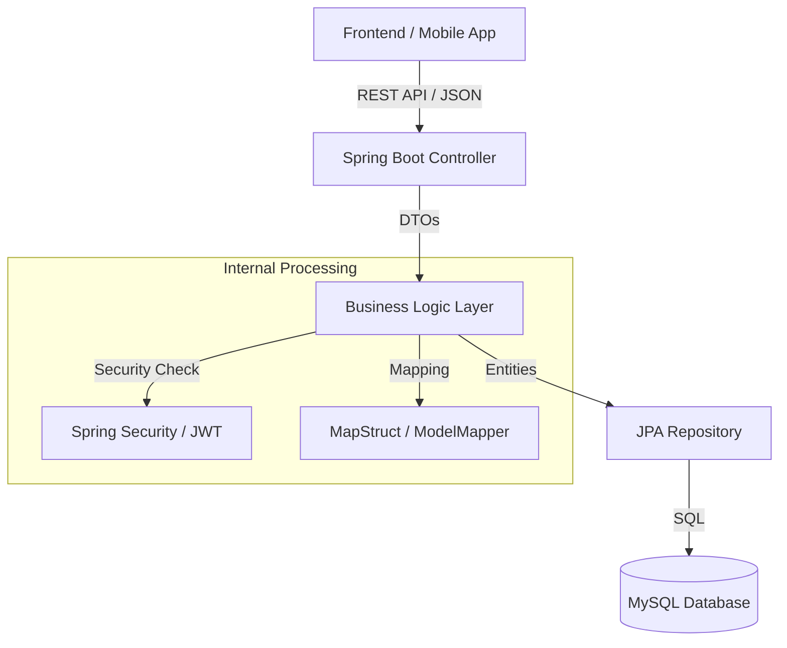

# 🛡️ Defence Aspirant Portal – Backend

[](https://openjdk.org/projects/jdk/21/)
[](https://spring.io/projects/spring-boot)
[](https://www.mysql.com/)
[](LICENSE)

A robust, enterprise-grade Spring Boot backend designed for a comprehensive defence exam preparation platform. This system handles everything from exam notifications and mock tests to result tracking and user authentication.

---

## 🚀 Key Modules & Features

### 🔐 Authentication & Authorization
- **JWT-based Security**: Secure stateless authentication using JSON Web Tokens.
- **Role-Based Access Control (RBAC)**: Distinct permissions for `ADMIN` and `CANDIDATE` roles.
- **Secure Registration/Login**: Managed via `AuthController`.

### 📢 Notification Management
- **Dynamic Updates**: Real-time announcements for exam dates, admit cards, and results.
- **Content Management**: Store and retrieve detailed exam information like syllabus, patterns, and physical standards.

### 📝 Comprehensive Mock Test System
- **Advanced Exam Engine**: Support for multiple exam types (BSF, SSC, NDA, etc.).
- **Granular Question Bank**: MCQ and numeric questions with difficulty levels and section-wise organization.
- **Real-time Attempt Tracking**: Monitor test duration, status, and scores.

### 📊 Result Analytics
- **Performance History**: Track user scores and attempt statistics.
- **Rankings & Feedback**: (Planned) Comparative analysis and performance insights.

---

## 🏗️ System Architecture



---

## 🛠️ Technology Stack

| Category | Technology |
| :--- | :--- |
| **Core** | Java 21, Spring Boot 3.4.x |
| **Persistence**| Spring Data JPA, Hibernate, MySQL |
| **Security** | Spring Security, JJWT |
| **Mapping** | MapStruct, ModelMapper |
| **Utilities** | Lombok, Dotenv, Jakarta Validation |
| **API Docs** | Springdoc OpenAPI (Swagger) |

---

## ⚙️ Getting Started

### Prerequisites
- **Java JDK 21** or higher
- **Maven 3.8+**
- **MySQL 8.0+**

### 1. Database Configuration
Create a database named `defence_portal_db`:
```sql
CREATE DATABASE defence_portal_db;
```

### 2. Environment Setup
Create a `.env` file in the root directory (or update `src/main/resources/application.properties`):
```properties
SPRING_DATASOURCE_URL=jdbc:mysql://localhost:3306/defence_portal_db
SPRING_DATASOURCE_USERNAME=your_username
SPRING_DATASOURCE_PASSWORD=your_password
JWT_SECRET=your_base64_secret_key
```

### 3. Build & Run
```bash
# Clean and install dependencies
mvn clean install

# Run the application
mvn spring-boot:run
```

The server will start at `http://localhost:8080`.

---

## 📂 Project Structure

```text
src/main/java/com/defence/portal
├── auth/           # Authentication & Security module
├── notification/   # Notification & Announcements module
├── examportal/     # Core Mock Test & Question engine
│   ├── controller  # ADMIN & Public APIs
│   ├── service     # Business Logic
│   ├── repository  # Data Access
│   ├── entity      # JPA Models
│   └── dto         # Data Transfer Objects
├── config/         # Security & App configuration
└── exception/      # Global error handling
```

---

## � API Documentation

Once the app is running, you can explore the full interactive documentation at:
- **Swagger UI**: `http://localhost:8080/swagger-ui/index.html`

| Module | Base Path | Role |
| :--- | :--- | :--- |
| Auth | `/api/auth` | Public |
| Admin Exams | `/api/admin/exams` | ADMIN |
| Notifications | `/api/notifications` | Mixed |
| Mock Tests | `/api/exams` | CANDIDATE |

---

## 👨‍💻 Author

**Mahesh Yadav**
- 📧 [mahi234xp@gmail.com](mailto:mahi234xp@gmail.com)
- 🔗 [GitHub Profile](https://github.com/mahesh-ryadav)

---
*Developed with Passion for Defence Aspirants.*
